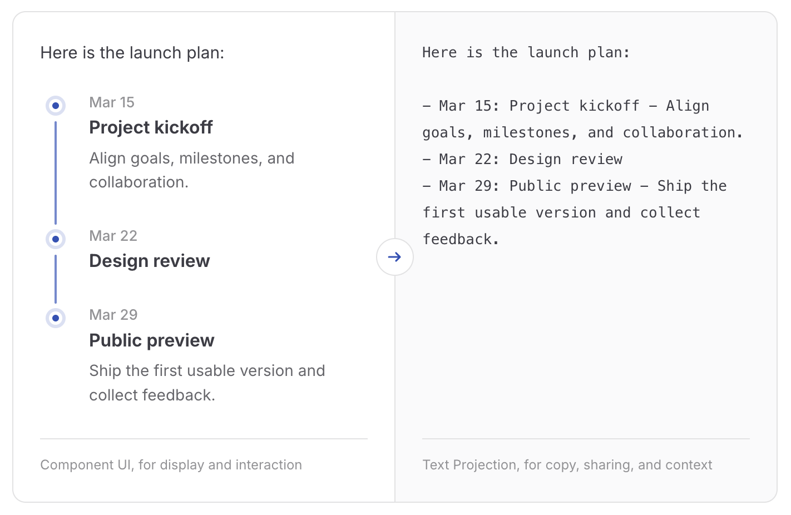

# MFUI

[English](./README.md) | [简体中文](./README.zh-CN.md)

Message-first generative UI with portable text projections.

MFUI gives every model response both component UI and text projection,
balancing display, interaction, copy, and context.



## Overview

In a typical chat UI, the model mostly emits Markdown. It can write lists,
tables, and code blocks, but it is a poor fit for content that wants richer
interaction: timelines, plans, metric cards, forms, charts, product cards, step
progress, expandable diagnostics, and similar UI.

Components are good for display, but they are not always good message history.
If a chat record only contains a visual component, copying the assistant message
loses content. Sending that history back to the model is also difficult because
the component's meaning is no longer available as normal text.

MFUI is a message protocol and toolkit that composes into the AI workflow you
already use. It lets the model produce structured interface data while the
application still owns visual rendering, interaction logic, and the design
system. The frontend defines components, schemas, and text projections; the
server gives those definitions to the model, validates returned component data,
and generates a stable text fallback.

| Form | Purpose |
| --- | --- |
| Component spec | Render rich UI in clients that support the component. |
| Text projection | Preserve a stable text representation for everything else. |

## Flow

The shortest MFUI path is:

1. Define components on the client. The renderer stays in your app.
2. Send a request manifest created from the component definitions this client
   supports.
3. Merge MFUI's prompt into your existing model call on the server.
4. Convert text plus completed `<mfui>` blocks into MFUI semantic SSE.
5. Read projected message snapshots with `streamMFUIMessage()` and render each
   part by type.

```ts
// client
const mfui = createMFUIManifest({
  components: [timelineDefinition],
});

const response = await fetch('/api/chat', {
  method: 'POST',
  headers: { Accept: 'text/event-stream', 'Content-Type': 'application/json' },
  body: JSON.stringify({ messages, mfui }),
});

for await (const message of streamMFUIMessage(response)) {
  renderAssistantMessage(message);
}
```

```ts
// server
const system = ['You are a helpful assistant.', createMFUIPrompt(mfui)]
  .filter(Boolean)
  .join('\n\n');

const upstream = await callModel({ system, messages, stream: true });

return createMFUIResponse(upstream, mfui, {
  onMessage(message) {
    // Persist message.portableText here.
  },
});
```

## Install

MFUI is split into a frontend package, a server package, and model adapters.
Install `@mfui/client` in the frontend, then install `@mfui/server` and the
adapter you need on the server.

```sh
pnpm add @mfui/client
```

```sh
pnpm add @mfui/server @mfui/openai-compatible
```

| Adapter | Use when |
| --- | --- |
| `@mfui/openai-compatible` | You use Chat Completions-compatible APIs. |
| `@mfui/openai-responses` | You use OpenAI Responses. |
| `@mfui/anthropic` | You use Anthropic Messages. |
| `@mfui/gemini` | You use Gemini. |
| `@mfui/ai-sdk` | You use Vercel AI SDK. |

## Packages

| Package or entry point | Purpose |
| --- | --- |
| `@mfui/client` | Browser-side SDK for defining MFUI components, sending a serializable manifest to the server, reading MFUI semantic streams, and working with projected messages. |
| `@mfui/client/definitions` | Builtin component definitions. They provide schemas, model hints, and projection templates, not renderers. |
| `@mfui/client/layouts` | Builtin layout definitions, currently including `mfui.columns`. |
| `@mfui/server` | Server-side SDK for building MFUI prompts, parsing model output, validating component specs, and returning MFUI semantic SSE responses. |
| Adapter packages | Read provider text deltas, parse completed `<mfui>` blocks, and return MFUI semantic SSE. |

Builtin components and layouts are definitions only: schemas, model guidance,
and projection templates, with no visual renderers.

## Example

The runnable example lives in [`apps/examples`](./apps/examples). It uses a Vue
3 + Vite client and a Hono server that calls DashScope through the
OpenAI-compatible Chat Completions API.

```sh
pnpm --filter @mfui/examples dev:server
pnpm --filter @mfui/examples dev:client
```

The example uses an OpenAI-compatible stream and logs the final
`message.portableText` on the server.

## Development

```sh
pnpm docs:dev
pnpm docs:build
pnpm typecheck
pnpm test
pnpm build
```

## License

MIT
