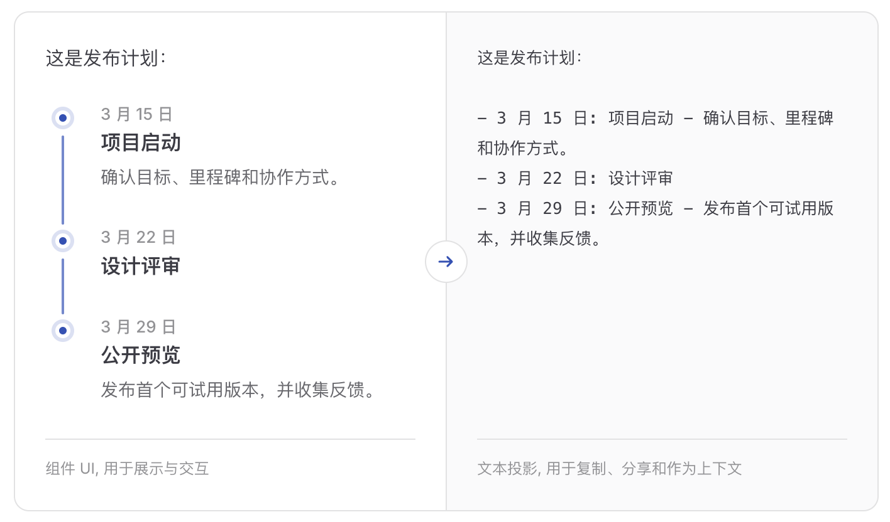

# MFUI

[English](./README.md) | [简体中文](./README.zh-CN.md)

可复制的生成式 UI。

MFUI 让模型回复同时拥有组件 UI 和文本投影，兼顾展示、交互、复制和上下文。



## 概览

在普通聊天界面里，模型通常只能输出 Markdown。它可以写出列表、表格和代码块，但很难表达更适合交互的内容：时间线、计划表、指标卡、表单、图表、商品卡片、步骤进度、可展开的诊断结果，等等。

组件很适合展示，却不一定适合作为消息历史。
如果聊天记录里只有一个视觉组件，用户复制消息时会丢失内容；服务端把历史上下文重新发给模型时，也很难表达这个组件的含义。

MFUI 是一层可以接入现有 AI 工作流的消息协议和工具包。它实现生成式 UI 的同时，也解决组件消息在复制、历史上下文、搜索和未知客户端里的表达问题。
应用仍然掌控视觉渲染、交互逻辑和设计系统；前端定义组件、schema 和文本投影；服务端把这些定义交给模型，校验模型返回的组件数据，并生成稳定的文本兜底。

| 形态 | 用途 |
| --- | --- |
| 组件规格 | 在支持该组件的客户端里渲染丰富 UI。 |
| 文本投影 | 为其它场景保留稳定的文本表示。 |

## 流程

最短的 MFUI 路径是：

1. 在客户端定义组件，渲染器仍然留在你的应用里。
2. 发送根据当前客户端组件定义创建出来的请求 manifest。
3. 在服务端把 MFUI prompt 合并进现有模型调用。
4. 把普通文本和完整 `<mfui>` 块转换成 MFUI semantic SSE。
5. 使用 `streamMFUIMessage()` 读取已投影的消息快照，并按 part 类型渲染。

```ts
// client
const mfui = createMFUIManifest({
  components: [timelineDefinition],
});

const response = await fetch('/api/chat', {
  method: 'POST',
  headers: { Accept: 'text/event-stream', 'Content-Type': 'application/json' },
  body: JSON.stringify({ messages, mfui }),
});

for await (const message of streamMFUIMessage(response)) {
  renderAssistantMessage(message);
}
```

```ts
// server
const system = ['You are a helpful assistant.', createMFUIPrompt(mfui)]
  .filter(Boolean)
  .join('\n\n');

const upstream = await callModel({ system, messages, stream: true });

return createMFUIResponse(upstream, mfui, {
  onMessage(message) {
    // 可以在这里持久化 message.portableText。
  },
});
```

## 安装

MFUI 分为前端包、服务端包和模型适配器。前端安装 `@mfui/client`；服务端安装 `@mfui/server` 和所需适配器。

```sh
pnpm add @mfui/client
```

```sh
pnpm add @mfui/server @mfui/openai-compatible
```

| 适配器 | 适用场景 |
| --- | --- |
| `@mfui/openai-compatible` | 使用兼容 Chat Completions 的 API。 |
| `@mfui/openai-responses` | 使用 OpenAI Responses。 |
| `@mfui/anthropic` | 使用 Anthropic Messages。 |
| `@mfui/gemini` | 使用 Gemini。 |
| `@mfui/ai-sdk` | 使用 Vercel AI SDK。 |

## 包

| 包或入口 | 用途 |
| --- | --- |
| `@mfui/client` | 浏览器端 SDK，用于定义 MFUI 组件、向服务端发送可序列化 manifest、读取 MFUI 语义流，并处理已投影消息。 |
| `@mfui/client/definitions` | 内置组件定义。它们提供 schema、模型提示和投影模板，不包含渲染器。 |
| `@mfui/client/layouts` | 内置布局定义，目前包含 `mfui.columns`。 |
| `@mfui/server` | 服务端 SDK，用于构建 MFUI prompt、解析模型输出、校验组件 spec，并返回 MFUI semantic SSE 响应。 |
| 适配器包 | 读取提供商文本增量，解析完整的 `<mfui>` 块，并返回 MFUI semantic SSE。 |

内置组件和布局只是定义：它们包含 schema、模型提示和投影模板，不包含视觉渲染器。

## 示例

可运行示例位于 [`apps/examples`](./apps/examples)。它使用 Vue 3 + Vite 客户端和 Hono 服务端，通过 OpenAI-compatible Chat Completions API 调用 DashScope。

```sh
pnpm --filter @mfui/examples dev:server
pnpm --filter @mfui/examples dev:client
```

示例使用 OpenAI-compatible 流，并在服务端打印最终的 `message.portableText`。

## 开发

```sh
pnpm docs:dev
pnpm docs:build
pnpm typecheck
pnpm test
pnpm build
```

## 许可证

MIT
